# PRAKTIKUM MODUL 1 JARINGAN KOMPUTER K-27

## Member

| Nama | NRP |
| :--- | :--- |
| Muhammad Nadhif Pasya Ikhsan | 5027251021 |
| Akhdan Hafiz Anugrah | 5027251094 |

## Soal 1
membuat tiga Switch/Gateway: Switch 1 menuju dua Entitas yaitu Alice dan Mika, Switch 2 menuju Chisa, sedangkan Switch 3 menuju Knights dan Eiri. Kelima Entitas tersebut dikonfigurasi sebagai Client di GNS3.


Konfigurasi setiap client
- Client 1 (alice)
``` 
auto eth0
iface eth0 inet static
    address 10.77.1.2
    netmask 255.255.255.0
    gateway 10.77.1.1
```

- Client 2 (Mika)
```
auto eth0
iface eth0 inet static
    address 10.77.1.3    
    netmask 255.255.255.0
    gateway 10.77.1.1
```

- Client 3 (Chisa)
```
auto eth0
iface eth0 inet static
    address 10.77.2.2
    netmask 255.255.255.0
    gateway 10.77.2.1
```

- Client 4 (Knight)
```
auto eth0
iface eth0 inet static
    address 10.77.3.2
    netmask 255.255.255.0
    gateway 10.77.3.1
```

Client 5 (Eiri)
```
auto eth0
iface eth0 inet static
    address 10.77.3.3
    netmask 255.255.255.0
    gateway 10.77.3.1
```

## Soal 2
Karena menurut Lain pada saat itu The Wired masih terisolasi dari dunia luar, konfigurasikan router Lain agar dapat tersambung langsung ke jaringan internet publik melalui NAT/DHCP pada interface eth0.
```
auto eth0
iface eth0 inet dhcp
up iptables -t nat -A POSTROUTING -o eth0 -j MASQUERADE 

auto eth1
iface eth1 inet static
    address 10.77.1.1
    netmask 255.255.255.0

auto eth2
iface eth2 inet static
    address 10.77.2.1
    netmask 255.255.255.0

auto eth3
iface eth3 inet static
    address 10.77.3.1
    netmask 255.255.255.0

sysctl -w net.ipv4.ip_forward=1
```

## Soal 3
Setelah router Lain terhubung ke internet, pastikan seluruh Entitas (Client) di bawah Switch 1, Switch 2, dan Switch 3 dapat saling terhubung dan berkomunikasi satu sama lain melalui konfigurasi routing.

Agar bisa berkomunikasi satu sama lain yaitu dengan menambahkan konfigurasi router dibawah ini:
`sysctl -w net.ipv4.ip_forward=1`

contoh ping client lain:


## Soal 4
Lain ingin agar setiap Entitas (Client) memiliki kemandirian di The Wired. Konfigurasikan firewall/iptables (NAT Masquerade) dan DNS resolver agar setiap Client dapat terhubung ke internet secara mandiri (dapat melakukan ping ke 8.8.8.8 dan membuka domain web google.com).

caranya agar bisa `ping google.com` yaitu dengan menambahkan `up echo "nameserver 8.8.8.8" > /etc/resolv.conf` ke konfigurasi setiap client.


## Soal 5
Buat script verifikasi di /root/cek_status.sh pada router Lain yang menampilkan ringkasan interface (ip -br a) dan status tabel NAT (iptables -t nat -L -v -n) setelah reboot.


## Soal 6

Menjalankan traffic generator dan melakukan packet sniffing dengan filter `dns or icmp`


## Soal 7

Chisa memutuskan mendirikan FTP Server pada node miliknya dengan shared folder di /var/wired/data. Terapkan kebijakan akses: user alice (hak akses read & write), user mika (dibatasi read-only), dan user eiri (dibatasi tanpa izin akses / blacklist). Buktikan konfigurasi dengan membuat file signal_alice.txt dari user alice, dan buktikan penolakan akses saat user eiri mencoba login.

disini kita memmbuat script `ftp.sh` untuk setup ftp server nya
```
cat << 'EOF' > /root/setup_ftp.sh
#!/bin/bash
apt-get update && apt-get install -y vsftpd

# Buat folder penyimpanan bersama
mkdir -p /var/wired/data
chmod 777 /var/wired/data

# Buat user sistem
useradd -m -s /bin/bash alice && echo "alice:password" | chpasswd
useradd -m -s /bin/bash mika && echo "mika:password" | chpasswd
useradd -m -s /bin/bash eiri && echo "eiri:password" | chpasswd

# Blacklist user eiri pada vsftpd
echo "eiri" >> /etc/vsftpd.userlist

# Konfigurasi vsftpd
cat << 'EOC' > /etc/vsftpd.conf
anonymous_enable=NO
local_enable=YES
write_enable=YES
local_umask=022
dirmessage_enable=YES
xferlog_enable=YES
connect_from_port_20=YES
chroot_local_user=NO
secure_chroot_dir=/var/run/vsftpd/empty
pam_service_name=vsftpd
userlist_enable=YES
userlist_file=/etc/vsftpd.userlist
userlist_deny=YES
local_root=/var/wired/data
EOC

service vsftpd restart || /usr/sbin/vsftpd /etc/vsftpd.conf &
EOF
chmod +x /root/setup_ftp.sh
bash /root/setup_ftp.sh


echo "listen=YES" >> /etc/vsftpd.conf
service vsftpd restart
```

Pengecekan login menggunakan usn Alice:


Pengecekan login menggunakan usn Mika:


Pengecekan login menggunakan usn Eiri:


## Soal 8
Kelompok rahasia Knights perlu mengirimkan dokumen laporan intelijen ke FTP Server Chisa. Lakukan koneksi FTP client dari node Knights ke FTP Server Chisa menggunakan akun alice. Upload file berikut (link file). Analisis sesi Wireshark dan sebutkan: perintah FTP untuk upload (STOR), kode status sukses server (226), dan port data TCP yang dinegosiasikan pada mode PASV.

ada port TCP Knight (58712) dan chisa (58874) mereka melakukan TCP Handshake untuk STOR Knight_report.txt.


## Soal 9
Mika mengakses dokumen Protokol Tujuh di (link file) dari FTP Server Chisa. Dari node Mika, unduh file tersebut menggunakan akun mika. Setelah itu, buktikan pembatasan read-only dengan mencoba mengunggah file baru dari akun mika, dan tunjukkan pesan error respon server (error 550 Permission denied) saat mika mencoba melakukan upload.

upload sementara menggunakan alice:


download file protocol7:


pembuktian read-only:


## Soal 10

Knights melancarkan uji ketahanan koneksi ke server Chisa untuk menguji latensi jaringan The Wired. Kirimkan paket ping dari node Knights ke node Chisa dengan payload khusus 128 bytes dan interval 0.3 detik sebanyak 77 paket (ping -c 77 -s 128 -i 0.3 <IP_Chisa>). Buka Wireshark, catat nilai ICMP Type dan Code untuk Echo Request vs Echo Reply, serta analisis packet loss dan RTT (min/avg/max).

Request type (8) dan code (0):


Reply type (0) dan code (0):


Analisis Packet loss dan RTT:


## Soal 11

Buktikan kelemahan protokol Telnet dengan membuat akun phantom_user dan password wired_ghost pada layanan telnetd di node Chisa. Lakukan login Telnet dari node Eiri ke node Chisa dan tangkap sesi menggunakan Wireshark. Tunjukkan kredensial plain text melalui fitur Follow TCP Stream, serta jelaskan mengapa setiap karakter terkirim dalam paket TCP terpisah.

kredensial plain text:


Setiap karakter terkirim dalam paket TCP terpisah karena Telnet dirancang untuk interaksi terminal secara interaktif. Dalam mode karakter, ketika user menekan sebuah tombol, client dapat langsung mengirim karakter tersebut ke server tanpa menunggu user menekan Enter.

## Soal 12

Alice mencurigai Knights menjalankan beberapa layanan rahasia di node-nya. Lakukan pemindaian port dari node Alice ke node Knights menggunakan Netcat (nc) untuk memeriksa port 22 (SSH) dan 80 (HTTP) dalam keadaan terbuka, serta port rahasia 7777 dalam keadaan tertutup. Analisis di Wireshark perbedaan TCP Flag yang dikembalikan antara port terbuka (SYN-ACK) dengan port tertutup (RST-ACK).


Apabila netcat ke port yang terbuka akan terjadi threeway handshake dan apabila ke port yang tertutup itu akan mengembalikan RST,ACK.

## Soal 13
Lain memerintahkan agar administrasi jarak jauh menggunakan SSH secara aman tanpa password. Install OpenSSH server pada node Knights, buat pasangan kunci SSH (ssh-keygen) pada node Mika untuk user mika_admin, dan konfigurasikan public key authentication (PasswordAuthentication no). Lakukan koneksi SSH dari node Mika ke node Knights, tangkap sesi menggunakan Wireshark, identifikasi paket Protocol Version Exchange dan Key Exchange, serta jelaskan mengapa kredensial tidak terlihat dalam bentuk teks terbuka seperti pada Telnet.

install SSH pada node knight:


Buat pasangan kunci SSH pada mika:


Protocol versioin exchange:


Key exchange:


Kredensial tidak terlihat seperti telnet karena SSH melakukan proses kriptografi terlebih dahulu. Setelah proses key exchange, komunikasi SSH dilindungi oleh enkripsi sehingga isi autentikasi dan data sesi tidak dapat dibaca sebagai teks biasa hanya dengan Follow TCP Stream.

## Soal 14
Setelah gagal mengakses FTP, Eiri melancarkan serangan brute-force terhadap form login web Alice. Analisis file capture wired_bruteforce.pcapng untuk mengidentifikasi alamat IP penyerang, target IP beserta port yang diserang, password user lain_admin yang berhasil ditembus, serta web server software dan versi yang dilaporkan pada response header. Validasi temuan kalian pada socket server: `nc 10.4.89.247 3401`

## Langkah Penyelesaian
1. **Analisis Paket Network (Wireshark)**
   - Buka file capture `soal14_wired_bruteforce.pcapng` di Wireshark.
   - Filter lalu lintas HTTP POST dengan query:
     ```text
     http.request.method == "POST"
     ```
   - Terlihat adanya permintaan HTTP POST secara berulang dari IP asal `172.26.7.50` menuju target IP `172.26.7.100` pada port `8080`.

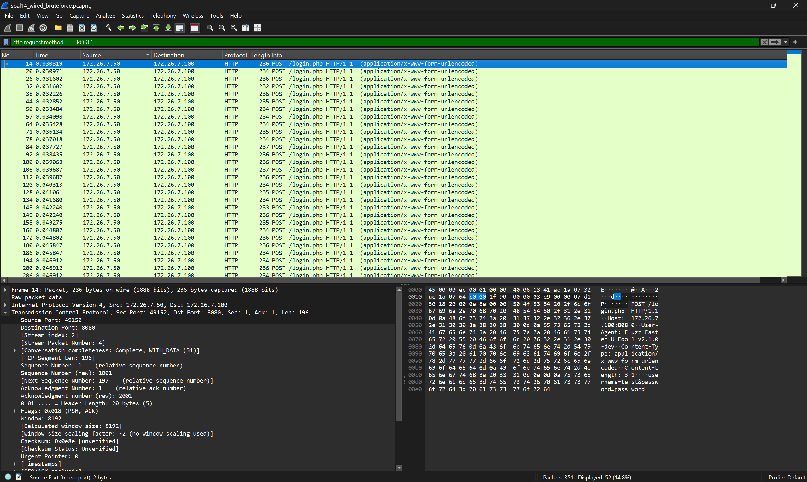

2. **Inspeksi HTTP Stream & Server Header**
   - Klik kanan salah satu paket HTTP POST, lalu pilih **Follow > HTTP Stream**.
   - Dari payload request, terdeteksi serangan menggunakan tool *fuzzing* dengan `User-Agent: Fuzz Faster U Fool v2.1.0-dev`.
   - Pada bagian HTTP Response Header, tercantum informasi web server yang digunakan, yaitu `Server: Apache/2.4.62`.

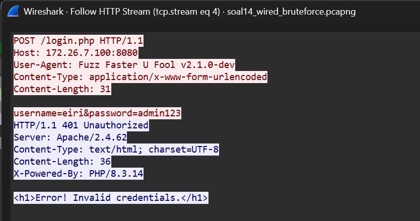 

3. **Menjawab Pertanyaan via Netcat**
   - Jalankan koneksi ke server soal:
     ```bash
     nc 10.4.89.247 3401
     ```
   - Input jawaban berdasarkan hasil analisis pcapng:
     * **Attacker IP**: `172.26.7.50`
     * **Target IP & Port**: `172.26.7.100:8080`
     * **Password `lain_admin`**: `wired_pr0tocol_7`
     * **Web Server & Version**: `Apache/2.4.62`

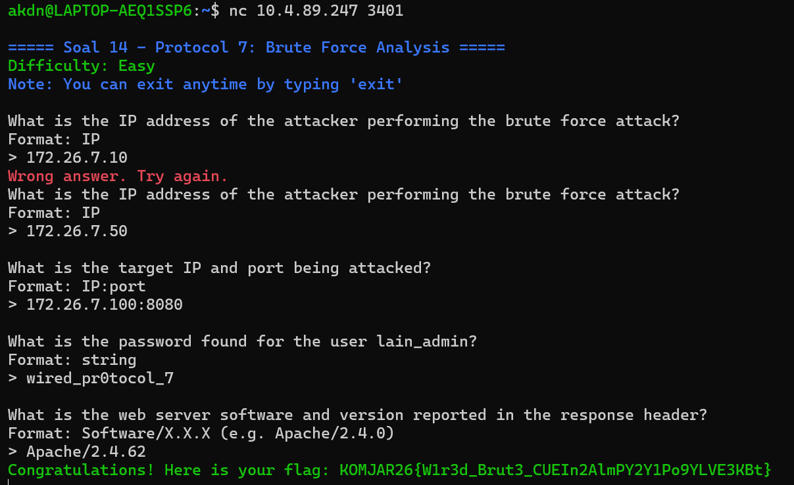

## Flag
`KOMJAR26{W1r3d_Brut3_CUEIn2AlmPY2Y1Po9YLVE3KBt}`

## Soal 15
Eiri menyusup ke ruang server dan memasang perangkat keyboard USB berbahaya pada node Alice. Buka file capture wired_usb_hid.pcap, identifikasi Vendor ID dan Product ID perangkat USB dari deskriptor USB, alamat nomor device USB, serta pesan rahasia yang berhasil dicuri dari keystroke. Validasi temuan kalian pada socket server: `nc 10.4.89.247 3402`

## Langkah Penyelesaian

1. **Identifikasi Vendor ID dan Product ID Perangkat USB**
   - Buka file `soal15_wired_usb_hid.pcap` di Wireshark.
   - Filter *Device Descriptor* menggunakan query:
     ```text
     usb.bDescriptorType == 1
     ```
   - Inspect paket **GET DESCRIPTOR Response DEVICE** untuk melihat detail perangkat:
     * **Vendor ID (`idVendor`)**: `046d` (Logitech, Inc.)
     * **Product ID (`idProduct`)**: `c31c` (Keyboard K120)

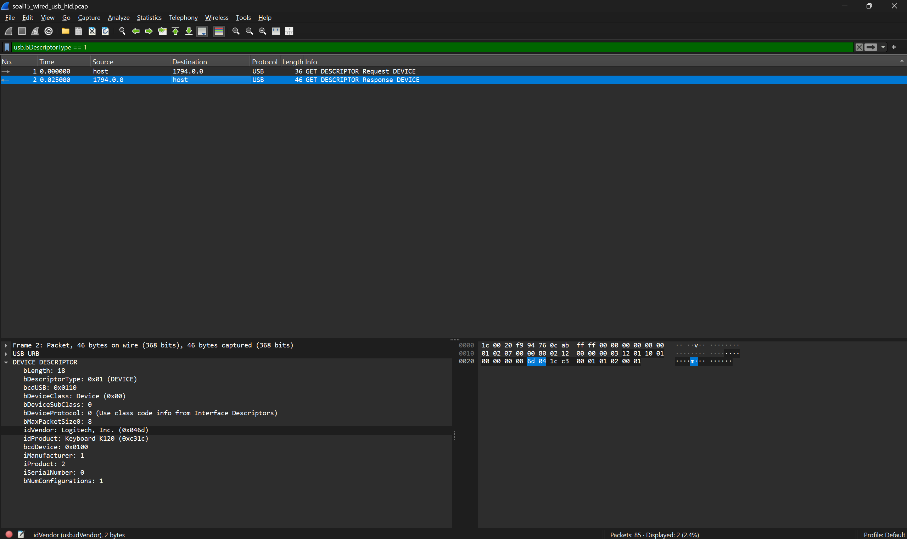

2. **Menentukan Device Address Keyboard**
   - Filter lalu lintas data *interrupt transfer* dari keyboard dengan query:
     ```text
     usb.transfer_type == 0x01 && usb.endpoint_address.direction == 1
     ```
   - Lihat alamat pada kolom **Source** (`2.7.1`), di mana angka tengah menunjukkan alamat perangkat.
   - Didapatkan **USB Device Address**: `7`.

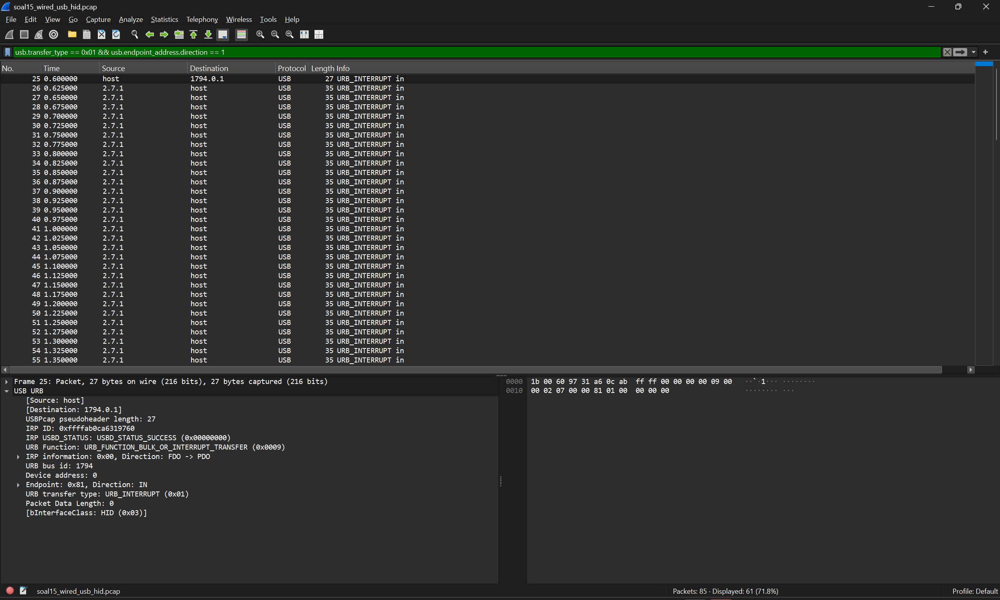

3. **Ekstraksi dan Dekode Keystroke Data**
   - Lakukan inspeksi pada *Leftover Capture Data* / *USB HID Data* pada paket `URB_INTERRUPT in` untuk melihat struktur byte keycode.
   - Disini kami melakukan Apply as Column sehingga mendapatkan informasi `Leftover` yang dimana sangat penting dalam memunculkan kode biner yang muncul, yang nantinya akan digunakan untuk memecahkan pesan rahasianya.

   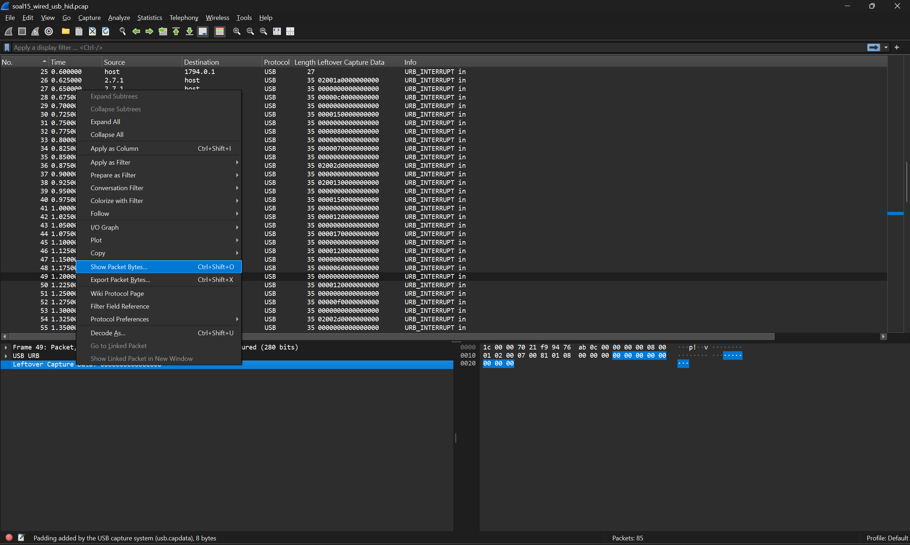

4. **Menjawab Pertanyaan via Netcat**
   - Jalankan koneksi ke server soal:
     ```bash
     nc 10.4.89.247 3402
     ```
   - Input jawaban berdasarkan hasil analisis pcap:
     * **Vendor ID**: `046d`
     * **Product ID**: `c31c`
     * **USB Device Address**: `7`
     * **Secret Message**: `wired_protocol_7_is_alive_2026`

   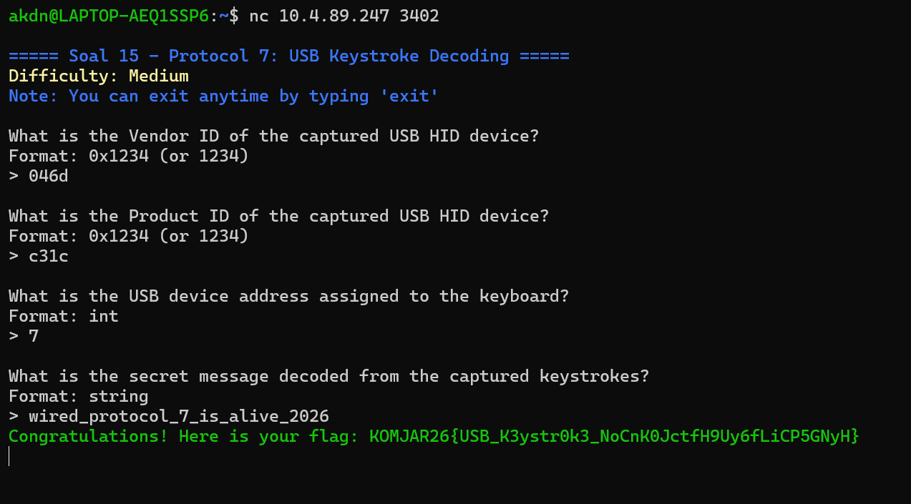

## Flag
`KOMJAR26{USB_K3ystr0k3_NoCnK0JctfH9Uy6fLiCP5GNyH}`

## Soal 16
Eiri meletakkan file malware di server. Dari file capture wired_ftp_theft.pcap, lakukan analisis lalu lintas FTP untuk mengidentifikasi alamat IP server FTP penyerang, banner software FTP yang digunakan, kredensial login penyerang, serta ukuran (size in bytes) dari file malware knights_payload.exe yang diunduh. Validasi temuan kalian pada socket server: `nc 10.4.89.247 3403`

## Langkah Penyelesaian

1. **Analisis Paket Network & Filter FTP (Wireshark)**
   - Buka file capture `soal16_wired_ftp_theft.pcapng` di Wireshark.
   - Terapkan filter lalu lintas kontrol FTP dengan query:
     ```text
     tcp.port == 21
     ```
   - Terlihat transaksi lalu lintas FTP dari beberapa alamat IP yang terekam pada lalu lintas jaringan.

    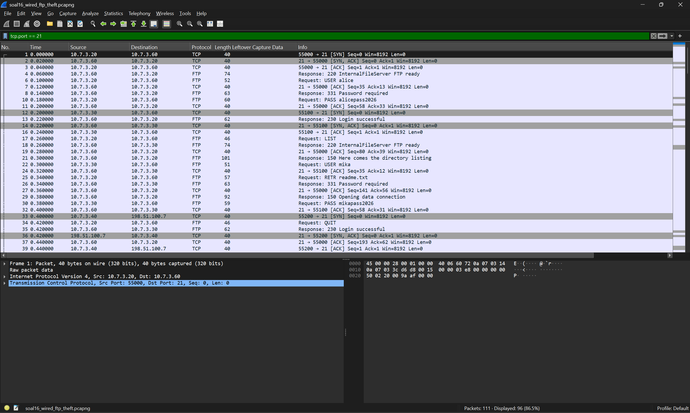

2. **Inspeksi TCP Stream Percakapan FTP**
   - Klik kanan pada salah satu paket FTP, lalu pilih **Follow > TCP Stream** (atau filter `tcp.stream eq 6`).
   - Dari payload interaksi FTP penyerang, diperoleh beberapa informasi utama:
     * **FTP Server Software Banner**: Ditemukan respon awal server `220 Welcome to Wired FTP Server (vsftpd 3.0.5)`.
     * **Kredensial Penyerang**: Ditemukan perintah `USER knights_agent` dan `PASS N4v1_s3cur3_2026`.
     * **Ukuran File Malware**: Ditemukan respon server `213 524288` terhadap perintah `SIZE knights_payload.exe` serta respon `150 Opening BINARY mode data connection for knights_payload.exe (524288 bytes)`.
     * **IP Server FTP**: Ditemukan respon passive mode `227 Entering Passive Mode (198,51,100,7,156,64)` yang menunjukkan IP server `198.51.100.7`.

     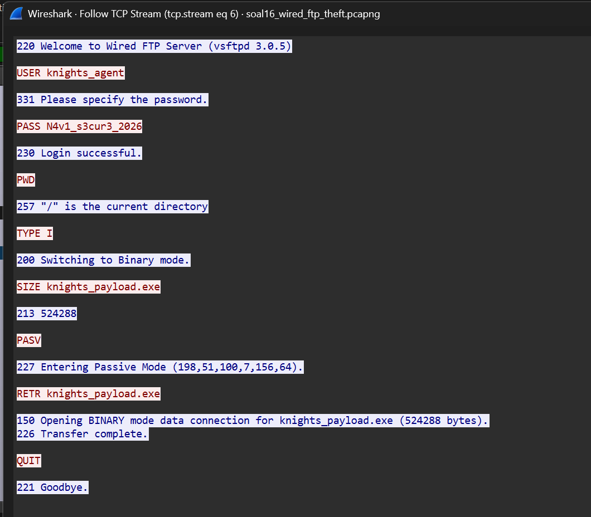

3. **Menjawab Pertanyaan via Netcat**
   - Jalankan koneksi ke server validasi soal:
     ```bash
     nc 10.4.89.247 3403
     ```
   - Input jawaban berdasarkan hasil analisis pcapng:
     * **FTP Server IP**: `198.51.100.7`
     * **FTP Banner**: `vsftpd 3.0.5`
     * **Attacker Credentials (`user:pass`)**: `knights_agent:N4v1_s3cur3_2026`
     * **Malware File Size**: `524288`

     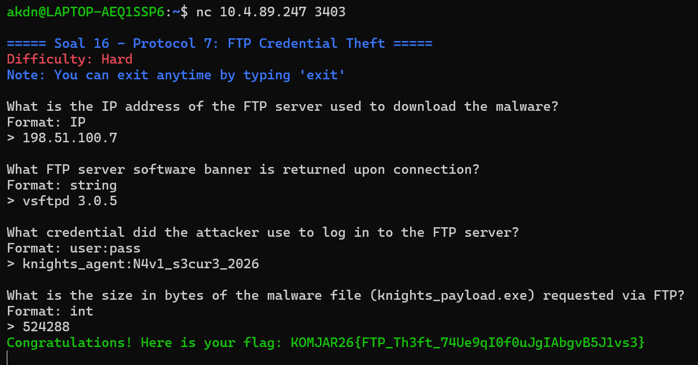

## Flag
`KOMJAR26{FTP_Th3ft_74Ue9qI0f0uJgIAbgvB5J1vs3}`

## Soal 17
Alice membuat halaman web di node-nya. Eiri memanfaatkan celah untuk mengunduh payload berbahaya ke sistem Alice. Analisis file capture wired_http_c2.pcap untuk mengidentifikasi nama domain (Host) tempat malware diunduh, alamat IP server penyerang, nama file executable malware yang diunduh, serta kode status HTTP yang dikembalikan. Validasi temuan kalian pada socket server: `nc 10.4.89.247 3404`

## Langkah Penyelesaian

1. **Analisis Paket Network & Filter HTTP (Wireshark)**
   - Buka file capture `soal17_wired_http_c2.pcapng` di Wireshark.
   - Terapkan filter lalu lintas HTTP GET request dengan query:
     ```text
     http.request.method == "GET"
     ```
   - Terlihat permintaan pengunduhan berkas executable `navi_agent.exe` dari IP klien menuju IP target `203.0.113.42`.

   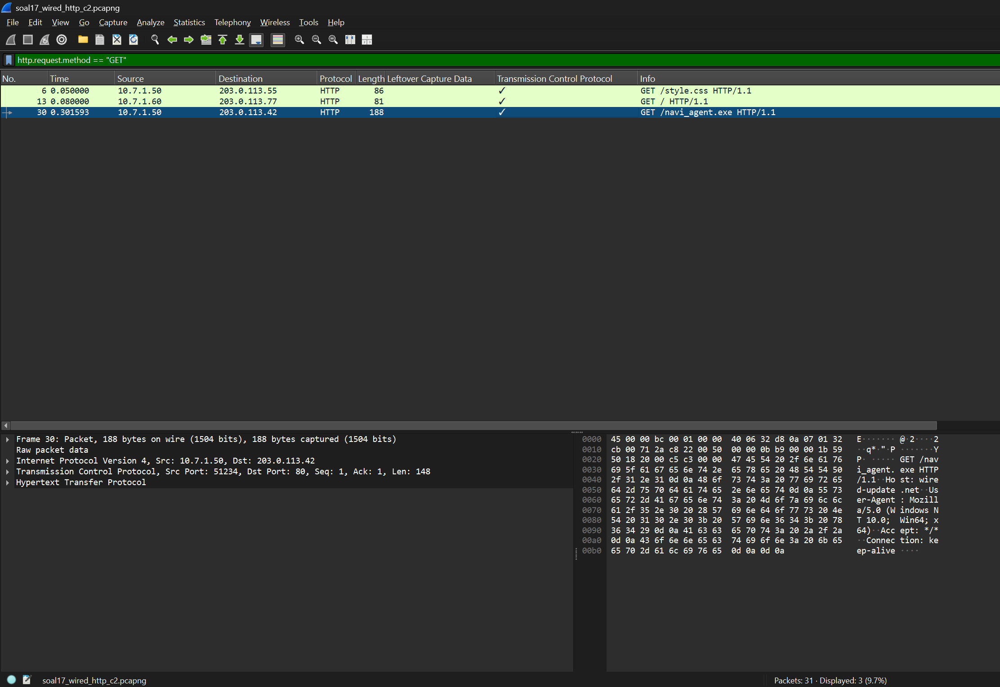

2. **Inspeksi HTTP Stream & Detail Malware**
   - Klik kanan pada paket HTTP GET `/navi_agent.exe`, lalu pilih **Follow > HTTP Stream** (atau filter `tcp.stream eq 4`).
   - Dari payload interaksi HTTP, diperoleh beberapa informasi utama:
     - **Domain Name (Host)**: Ditemukan header `Host: wired-update.net`.
     - **Attacker IP Address**: `203.0.113.42` (diidentifikasi dari IP server penampung file).
     - **Malware Filename**: `navi_agent.exe` (diambil dari endpoint `GET /navi_agent.exe` dan header `Content-Disposition`).
     - **HTTP Status Code**: `200` (dikonfirmasi dari respon server `HTTP/1.1 200 OK`).

     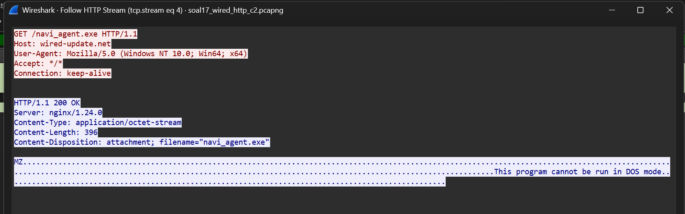

3. **Menjawab Pertanyaan via Netcat**
   - Jalankan koneksi ke server validasi soal:
     ```bash
     nc 10.4.89.247 3404
     ```
   - Input jawaban berdasarkan hasil analisis pcapng:
     * **Domain Name (Host)**: `wired-update.net`
     * **Attacker IP**: `203.0.113.42`
     * **Malware Executable Filename**: `navi_agent.exe`
     * **HTTP Status Code**: `200`

     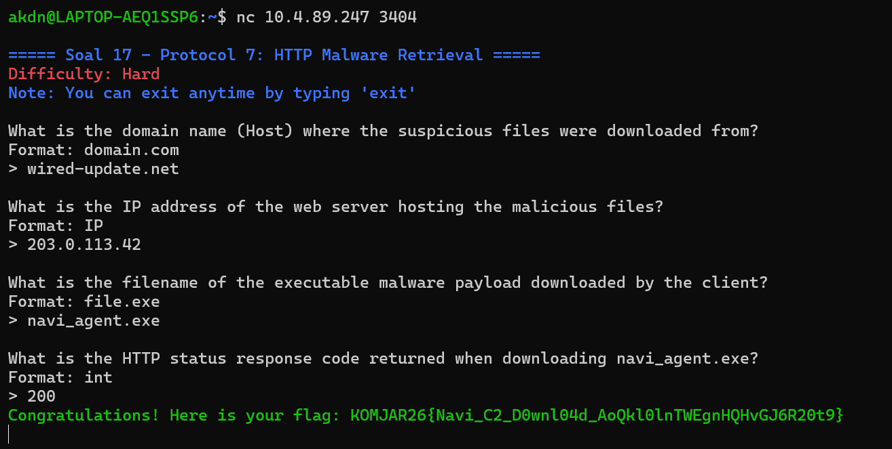

## Flag
`KOMJAR26{Navi_C2_D0wnl04d_AoQkl0lnTWEgnHQHvGJ6R20t9}`

## Soal 18
Eiri mengubah taktik penyerangan dengan menanamkan file malware menggunakan protokol file sharing SMB. Analisis file capture wired_smb_transfer.pcapng untuk mengidentifikasi nama protokol jaringan yang dieksploitasi, IP pengirim dan penerima, folder tujuan penyimpanan malware pada sistem korban, serta nama file executable malware yang ditransfer. Validasi temuan kalian pada socket server: `nc 10.4.89.247 3405`

## Langkah Penyelesaian

1. **Analisis Paket Network & Identifikasi Protokol (Wireshark)**

   * Buka file capture `soal18_wired_smb_transfer.pcapng` di Wireshark.
   * Terlihat alur komunikasi TCP pada port 445 yang mengindikasikan penggunaan protokol file sharing **SMB**.

   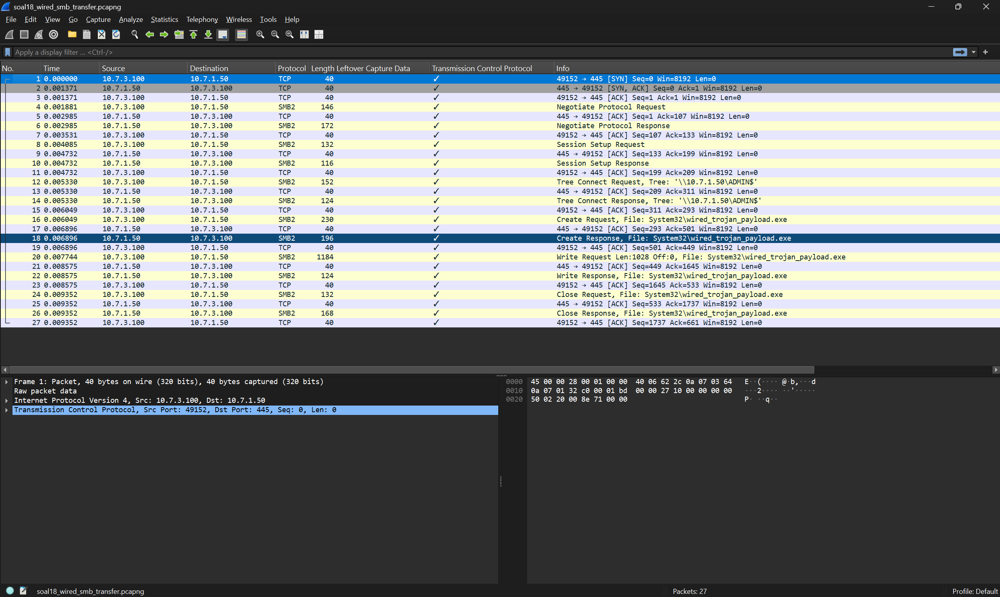

2. **Inspeksi Paket SMB2 & Parameter Serangan**

   * Terapkan display filter `smb2` pada Wireshark.
   * Amati lalu lintas transaksi SMB:
     * **Tree Connect Request**: Menunjukkan koneksi ke network share `\\10.7.1.50\ADMIN$`. 
       * **Source IP (Penyerang)**: `10.7.3.100`
       * **Destination IP (Korban)**: `10.7.1.50`
       * **Target Share**: `ADMIN$`
     * **Create Request**: Menunjukkan pembuatan berkas pada path `System32\wired_trojan_payload.exe`.
       * **Nama Executable Malware**: `wired_trojan_payload.exe`

       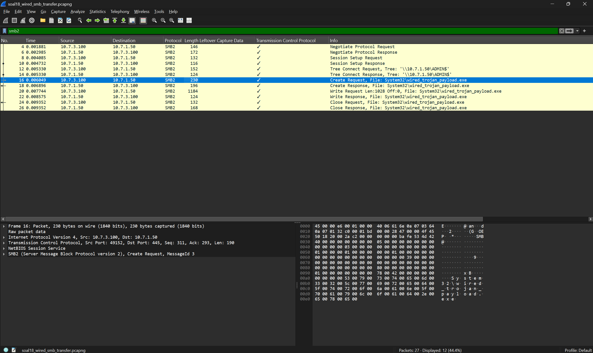

3. **Validasi Jawaban via Netcat**
   * Hubungkan ke server validasi soal:

     ```bash
     nc 10.4.89.247 3405
     ```

   * Masukkan parameter jawaban berikut secara berurutan:
     * **File sharing protocol**: `SMB`
     * **Source host IP (Attacker)**: `10.7.3.100`
     * **Victim host IP**: `10.7.1.50`
     * **Target share / directory**: `ADMIN$`
     * **Executable malware filename**: `wired_trojan_payload.exe`

     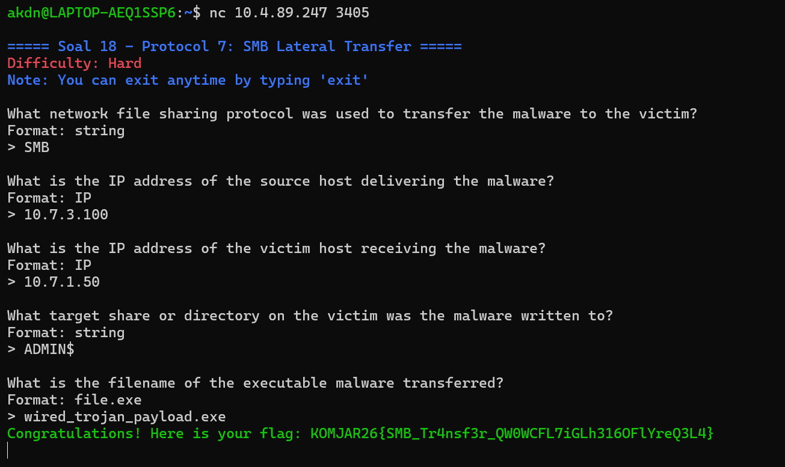

## Soal 19
Eiri meneror jaringan dengan mengirimkan email pemerasan melalui protokol SMTP tanpa enkripsi. Analisis file capture wired_smtp_threat.pcap pada stream TCP terkait, identifikasi alamat email korban yang ditargetkan, password korban yang diklaim bocor oleh penyerang, jenis malware yang diinfeksikan, batas waktu (dalam hari) yang diberikan, serta MailClientID yang tercantum pada pesan. Validasi temuan kalian pada socket server: `nc 10.4.89.247 3406`

## Langkah Penyelesaian

1. **Analisis Paket Network (Wireshark)**
   - Buka file capture `soal19_wired_smtp_threat.pcapng` di Wireshark.
   - Amati daftar lalu lintas paket jaringan secara keseluruhan.

    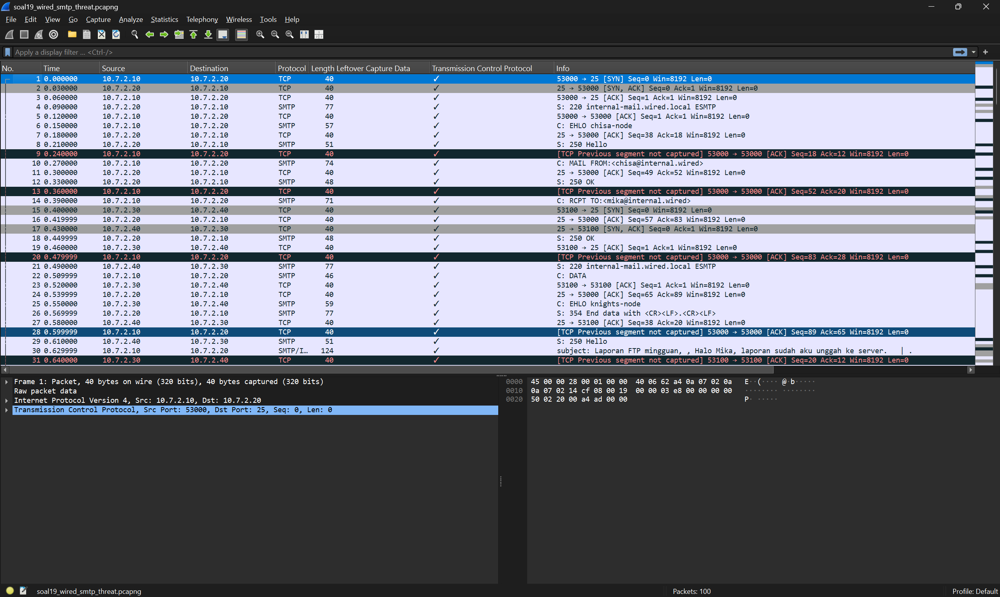

2. **Filter & Inspeksi SMTP Stream**
   - Filter lalu lintas protokol SMTP dengan query:
     ```text
     smtp
     ```
   - Klik kanan pada salah satu paket SMTP, lalu pilih **Follow > TCP Stream** untuk membaca isi pesan email pemerasan (*extortion*).
   - Ditemukan detail data sebagai berikut:
     * **Email Korban**: `victim@protocol7.co.jp`
     * **Password Korban**: `pr0tocol_7_user`
     * **Jenis Malware**: `ransomware`
     * **Batas Waktu (Deadline)**: `3` (hari)
     * **MailClientID**: `7719980706`

    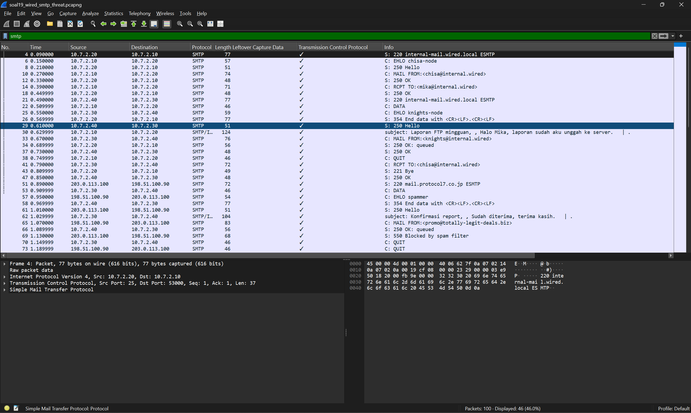

3. **Menjawab Pertanyaan via Netcat**
   - Jalankan koneksi ke server soal:
     ```bash
     nc 10.4.89.247 3406
     ```
   - Input jawaban berdasarkan hasil analisis pcapng:
     * **Victim Email**: `victim@protocol7.co.jp`
     * **Stolen Password**: `pr0tocol_7_user`
     * **Malware Type**: `ransomware`
     * **Deadline (Days)**: `3`
     * **MailClientID**: `7719980706`

     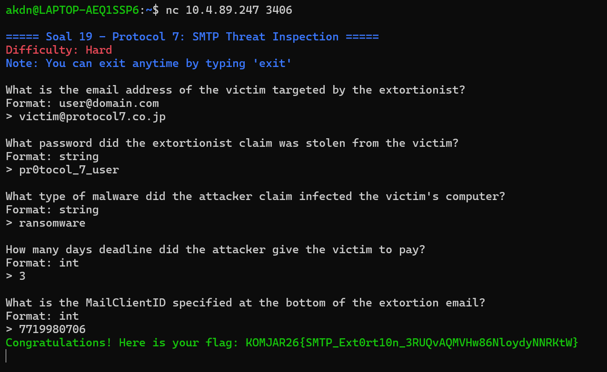

## Flag
`KOMJAR26{SMTP_Ext0rt10n_3RUQvAQMVHw86NloydyNNRKtW}`

## Soal 20
Untuk rencana pamungkasnya, Eiri menyembunyikan komunikasi malware di balik saluran terenkripsi TLS. Namun Alice telah menyediakan file keylog untuk mendekripsi lalu lintas data tersebut. Analisis file capture wired_tls_decrypt.pcapng bersama keyslogfile.txt untuk mengidentifikasi versi protokol TLS yang dinegosiasikan, nama domain (SNI) yang diakses, alamat IP server HTTPS penyerang, User-Agent yang digunakan, serta HTTP request method dan path yang tersembunyi di dalam sesi dekripsi. Validasi temuan kalian pada socket server: `nc 10.4.89.247 3407`

## Langkah Penyelesaian

1. **Konfigurasi Dekripsi TLS di Wireshark**
   - Buka file capture `wired_tls_decrypt.pcapng` di Wireshark.
   - Masuk ke menu **Edit > Preferences > Protocols > TLS**.
   - Pada kolom **(Pre)-Master-Secret log filename**, muat file `keyslogfile.txt`.
   - Klik **OK** untuk menerapkan dekripsi pada seluruh paket TLS.

     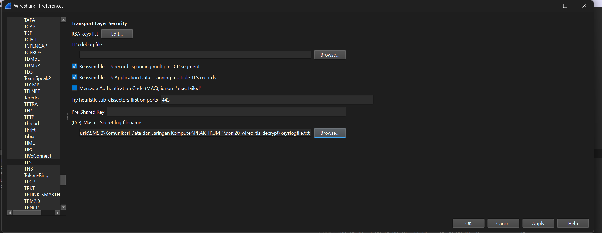

2. **Analisis Traffic Terdekripsi & Follow TLS Stream**
   - Setelah keylog dipasang, lalu lintas HTTP yang sebelumnya terenkripsi akan muncul pada daftar paket.

   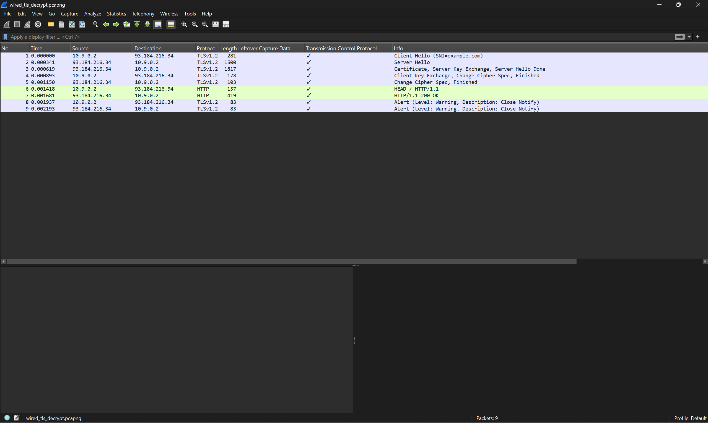

    - Klik kanan pada paket HTTP/TLS, lalu pilih **Follow > TLS Stream** untuk melihat detail payload HTTP request dan response:
     * **TLS Version**: `TLSv1.2`
     * **SNI / Host Domain**: `example.com`
     * **HTTPS Server IP**: `93.184.216.34`
     * **User-Agent**: `curl/7.62.0`
     * **HTTP Request Method & Path**: `HEAD / HTTP/1.1`

    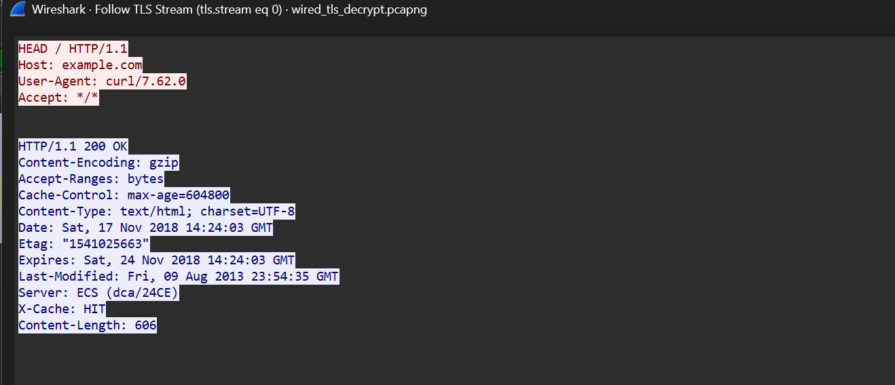

3. **Menjawab Pertanyaan via Netcat**
   - Jalankan koneksi ke server socket soal:
     ```bash
     nc 10.4.89.247 3407
     ```
   - Input jawaban berurutan sesuai hasil analisis pcapng:
     * **TLS Version**: `TLSv1.2`
     * **SNI / Host**: `example.com`
     * **HTTPS Server IP**: `93.184.216.34`
     * **User-Agent**: `curl/7.62.0`
     * **HTTP Request Method & Path**: `HEAD / HTTP/1.1`

     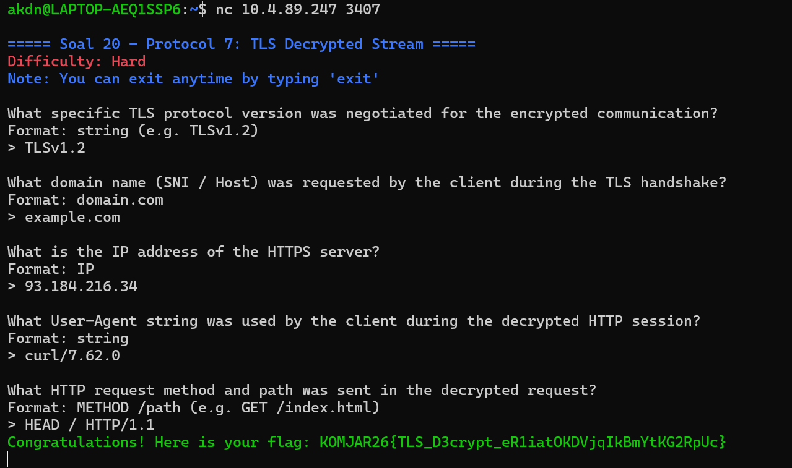

## Flag
`KOMJAR26{TLS_D3crypt_eR1liatOKDVjqIkBmYTKG2RpUc}`