# PRAKTIKUM MODUL 1 JARINGAN KOMPUTER K-27

## Soal 1
membuat tiga Switch/Gateway: Switch 1 menuju dua Entitas yaitu Alice dan Mika, Switch 2 menuju Chisa, sedangkan Switch 3 menuju Knights dan Eiri. Kelima Entitas tersebut dikonfigurasi sebagai Client di GNS3.

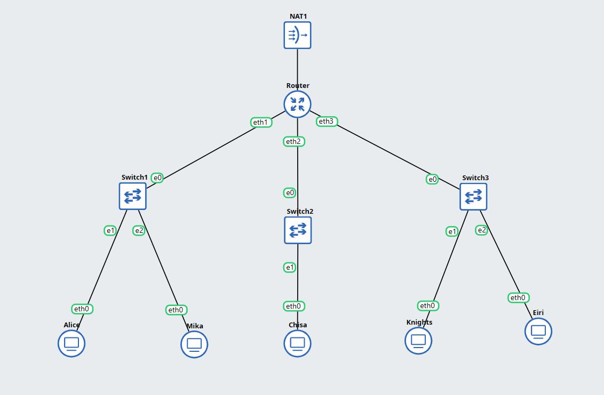

Konfigurasi setiap client
- Client 1 (alice)
``` 
auto eth0
iface eth0 inet static
    address 10.77.1.2
    netmask 255.255.255.0
    gateway 10.77.1.1
```

- Client 2 (Mika)
```
auto eth0
iface eth0 inet static
    address 10.77.1.3    
    netmask 255.255.255.0
    gateway 10.77.1.1
```

- Client 3 (Chisa)
```
auto eth0
iface eth0 inet static
    address 10.77.2.2
    netmask 255.255.255.0
    gateway 10.77.2.1
```

- Client 4 (Knight)
```
auto eth0
iface eth0 inet static
    address 10.77.3.2
    netmask 255.255.255.0
    gateway 10.77.3.1
```

Client 5 (Eiri)
```
auto eth0
iface eth0 inet static
    address 10.77.3.3
    netmask 255.255.255.0
    gateway 10.77.3.1
```

## Soal 2
Karena menurut Lain pada saat itu The Wired masih terisolasi dari dunia luar, konfigurasikan router Lain agar dapat tersambung langsung ke jaringan internet publik melalui NAT/DHCP pada interface eth0.
```
auto eth0
iface eth0 inet dhcp
up iptables -t nat -A POSTROUTING -o eth0 -j MASQUERADE 

auto eth1
iface eth1 inet static
    address 10.77.1.1
    netmask 255.255.255.0

auto eth2
iface eth2 inet static
    address 10.77.2.1
    netmask 255.255.255.0

auto eth3
iface eth3 inet static
    address 10.77.3.1
    netmask 255.255.255.0

sysctl -w net.ipv4.ip_forward=1
```

## Soal 3
Setelah router Lain terhubung ke internet, pastikan seluruh Entitas (Client) di bawah Switch 1, Switch 2, dan Switch 3 dapat saling terhubung dan berkomunikasi satu sama lain melalui konfigurasi routing.

Agar bisa berkomunikasi satu sama lain yaitu dengan menambahkan konfigurasi router dibawah ini:
`sysctl -w net.ipv4.ip_forward=1`

contoh ping client lain:
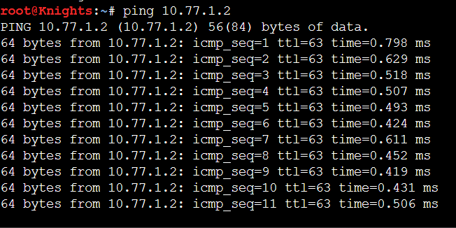

## Soal 4
Lain ingin agar setiap Entitas (Client) memiliki kemandirian di The Wired. Konfigurasikan firewall/iptables (NAT Masquerade) dan DNS resolver agar setiap Client dapat terhubung ke internet secara mandiri (dapat melakukan ping ke 8.8.8.8 dan membuka domain web google.com).

caranya agar bisa `ping google.com` yaitu dengan menambahkan `up echo "nameserver 8.8.8.8" > /etc/resolv.conf` ke konfigurasi setiap client.

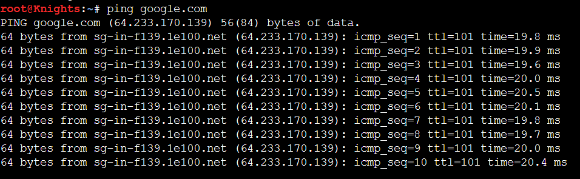

## Soal 5
Buat script verifikasi di /root/cek_status.sh pada router Lain yang menampilkan ringkasan interface (ip -br a) dan status tabel NAT (iptables -t nat -L -v -n) setelah reboot.

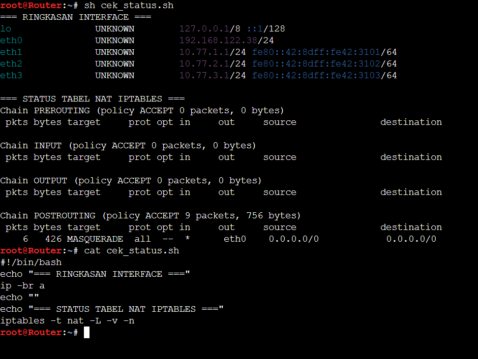

## Soal 6

Menjalankan traffic generator dan melakukan packet sniffing dengan filter `dns or icmp`

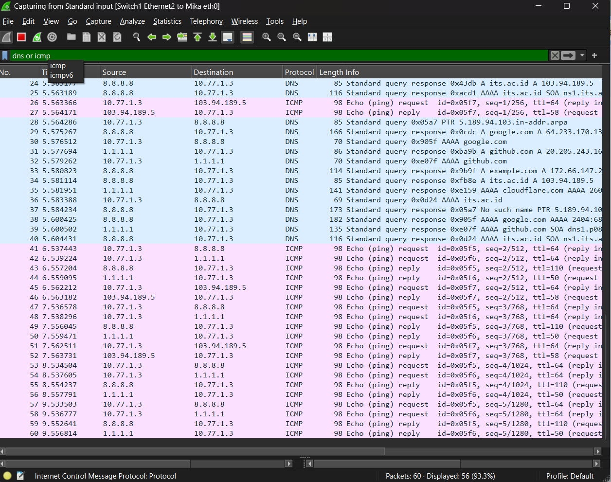

## Soal 7

Chisa memutuskan mendirikan FTP Server pada node miliknya dengan shared folder di /var/wired/data. Terapkan kebijakan akses: user alice (hak akses read & write), user mika (dibatasi read-only), dan user eiri (dibatasi tanpa izin akses / blacklist). Buktikan konfigurasi dengan membuat file signal_alice.txt dari user alice, dan buktikan penolakan akses saat user eiri mencoba login.

disini kita memmbuat script `ftp.sh` untuk setup ftp server nya
```
cat << 'EOF' > /root/setup_ftp.sh
#!/bin/bash
apt-get update && apt-get install -y vsftpd

# Buat folder penyimpanan bersama
mkdir -p /var/wired/data
chmod 777 /var/wired/data

# Buat user sistem
useradd -m -s /bin/bash alice && echo "alice:password" | chpasswd
useradd -m -s /bin/bash mika && echo "mika:password" | chpasswd
useradd -m -s /bin/bash eiri && echo "eiri:password" | chpasswd

# Blacklist user eiri pada vsftpd
echo "eiri" >> /etc/vsftpd.userlist

# Konfigurasi vsftpd
cat << 'EOC' > /etc/vsftpd.conf
anonymous_enable=NO
local_enable=YES
write_enable=YES
local_umask=022
dirmessage_enable=YES
xferlog_enable=YES
connect_from_port_20=YES
chroot_local_user=NO
secure_chroot_dir=/var/run/vsftpd/empty
pam_service_name=vsftpd
userlist_enable=YES
userlist_file=/etc/vsftpd.userlist
userlist_deny=YES
local_root=/var/wired/data
EOC

service vsftpd restart || /usr/sbin/vsftpd /etc/vsftpd.conf &
EOF
chmod +x /root/setup_ftp.sh
bash /root/setup_ftp.sh


echo "listen=YES" >> /etc/vsftpd.conf
service vsftpd restart
```

Pengecekan login menggunakan usn Alice:
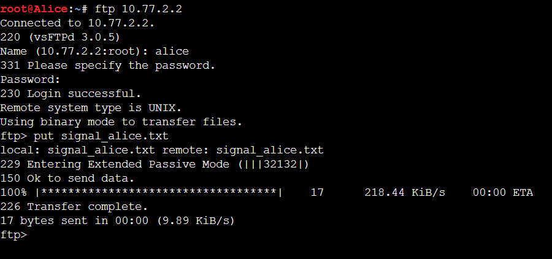

Pengecekan login menggunakan usn Mika:
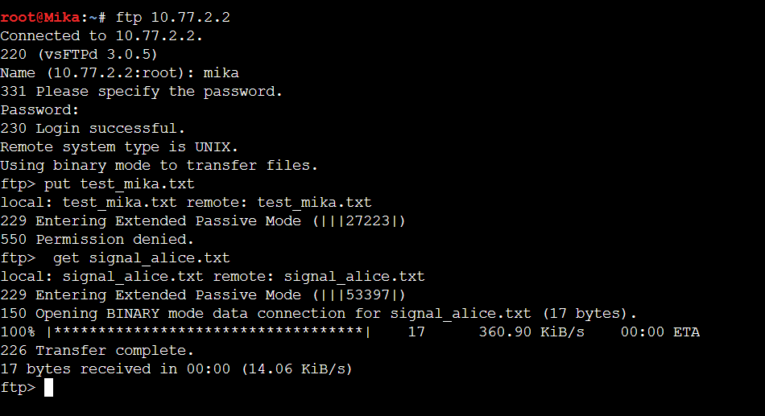

Pengecekan login menggunakan usn Eiri:
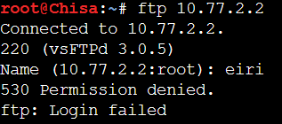

## Soal 8
Kelompok rahasia Knights perlu mengirimkan dokumen laporan intelijen ke FTP Server Chisa. Lakukan koneksi FTP client dari node Knights ke FTP Server Chisa menggunakan akun alice. Upload file berikut (link file). Analisis sesi Wireshark dan sebutkan: perintah FTP untuk upload (STOR), kode status sukses server (226), dan port data TCP yang dinegosiasikan pada mode PASV.

ada port TCP Knight (58712) dan chisa (58874) mereka melakukan TCP Handshake untuk STOR Knight_report.txt.
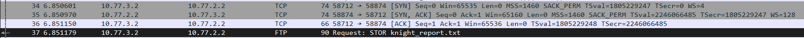

## Soal 9
Mika mengakses dokumen Protokol Tujuh di (link file) dari FTP Server Chisa. Dari node Mika, unduh file tersebut menggunakan akun mika. Setelah itu, buktikan pembatasan read-only dengan mencoba mengunggah file baru dari akun mika, dan tunjukkan pesan error respon server (error 550 Permission denied) saat mika mencoba melakukan upload.

upload sementara menggunakan alice:
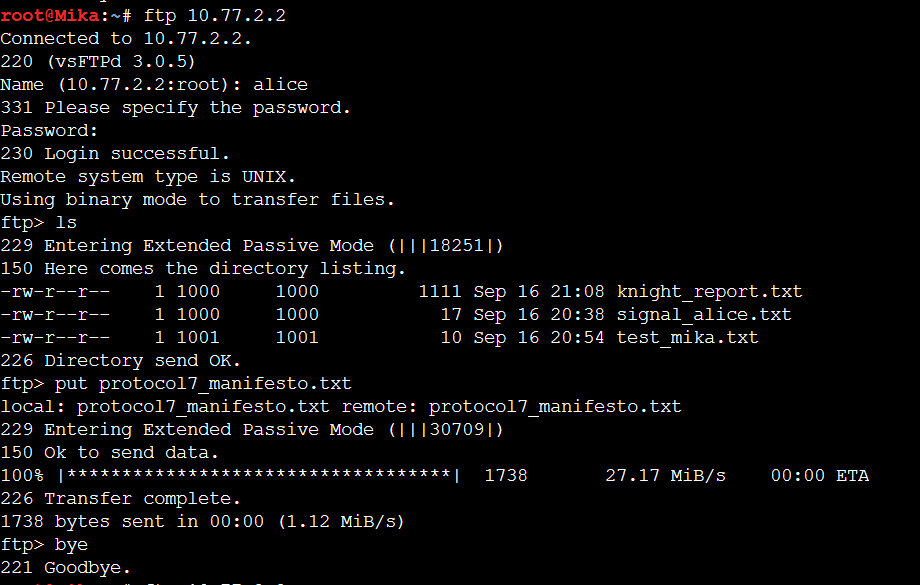

download file protocol7:
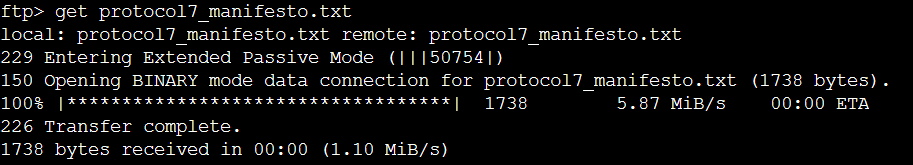

pembuktian read-only:
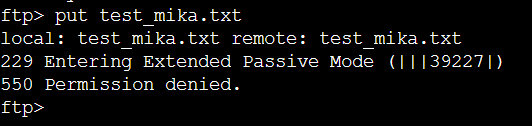


## Soal 10

Knights melancarkan uji ketahanan koneksi ke server Chisa untuk menguji latensi jaringan The Wired. Kirimkan paket ping dari node Knights ke node Chisa dengan payload khusus 128 bytes dan interval 0.3 detik sebanyak 77 paket (ping -c 77 -s 128 -i 0.3 <IP_Chisa>). Buka Wireshark, catat nilai ICMP Type dan Code untuk Echo Request vs Echo Reply, serta analisis packet loss dan RTT (min/avg/max).

Request type (8) dan code (0):
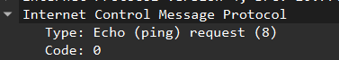

Reply type (0) dan code (0)
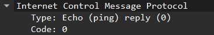

Analisis Packet loss dan RTT:
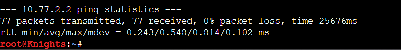

## Soal 11

Buktikan kelemahan protokol Telnet dengan membuat akun phantom_user dan password wired_ghost pada layanan telnetd di node Chisa. Lakukan login Telnet dari node Eiri ke node Chisa dan tangkap sesi menggunakan Wireshark. Tunjukkan kredensial plain text melalui fitur Follow TCP Stream, serta jelaskan mengapa setiap karakter terkirim dalam paket TCP terpisah.

kredensial plain text:
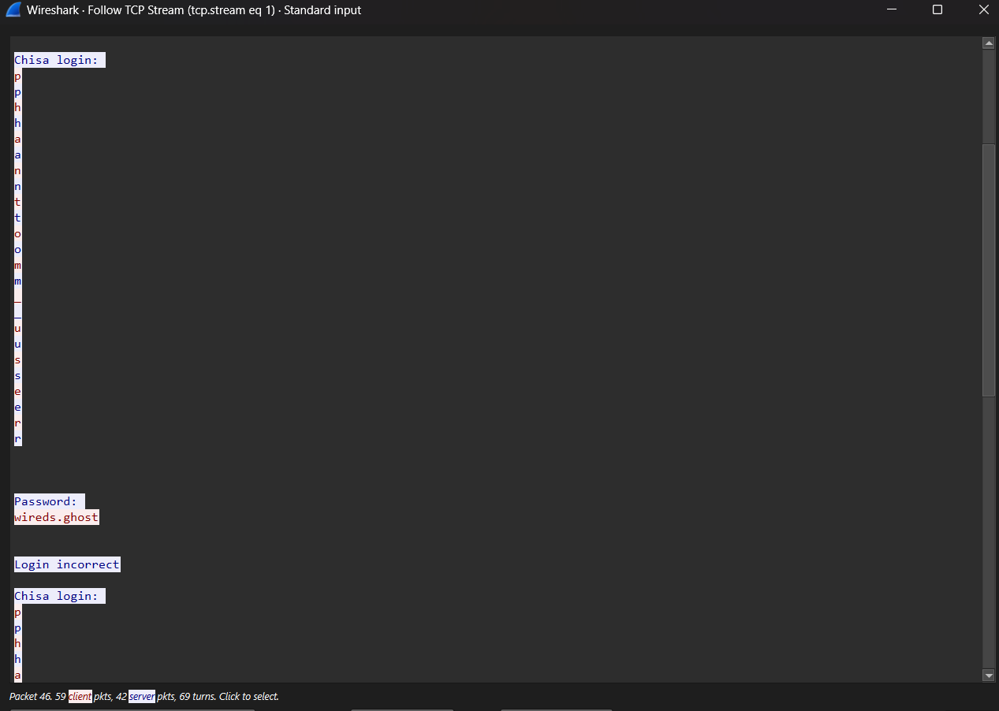

Setiap karakter terkirim dalam paket TCP terpisah karena Telnet dirancang untuk interaksi terminal secara interaktif. Dalam mode karakter, ketika user menekan sebuah tombol, client dapat langsung mengirim karakter tersebut ke server tanpa menunggu user menekan Enter.

## Soal 12

Alice mencurigai Knights menjalankan beberapa layanan rahasia di node-nya. Lakukan pemindaian port dari node Alice ke node Knights menggunakan Netcat (nc) untuk memeriksa port 22 (SSH) dan 80 (HTTP) dalam keadaan terbuka, serta port rahasia 7777 dalam keadaan tertutup. Analisis di Wireshark perbedaan TCP Flag yang dikembalikan antara port terbuka (SYN-ACK) dengan port tertutup (RST-ACK).

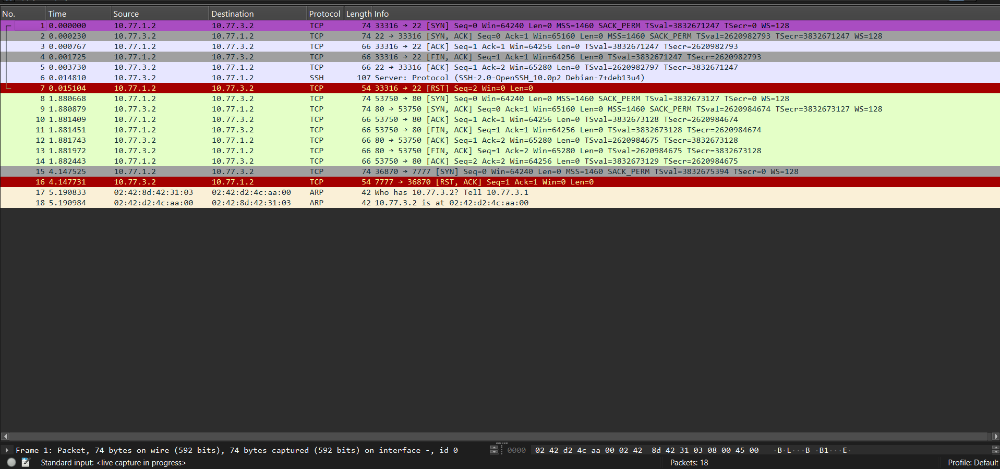

Apabila netcat ke port yang terbuka akan terjadi threeway handshake dan apabila ke port yang tertutup itu akan mengembalikan RST,ACK.

## Soal 13
Lain memerintahkan agar administrasi jarak jauh menggunakan SSH secara aman tanpa password. Install OpenSSH server pada node Knights, buat pasangan kunci SSH (ssh-keygen) pada node Mika untuk user mika_admin, dan konfigurasikan public key authentication (PasswordAuthentication no). Lakukan koneksi SSH dari node Mika ke node Knights, tangkap sesi menggunakan Wireshark, identifikasi paket Protocol Version Exchange dan Key Exchange, serta jelaskan mengapa kredensial tidak terlihat dalam bentuk teks terbuka seperti pada Telnet.

install SSH pada node knight:
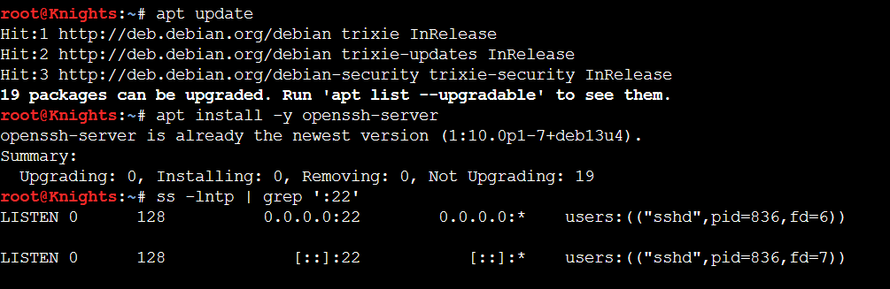

Buat pasangan kunci SSH pada mika:
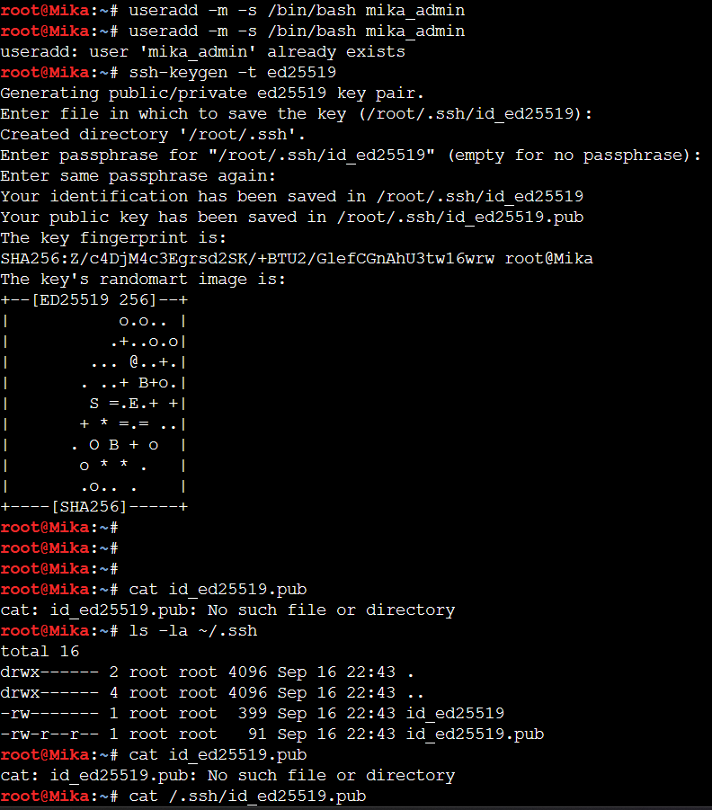

Protocol versioin exchange:
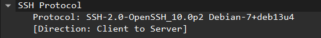

Key exchange:
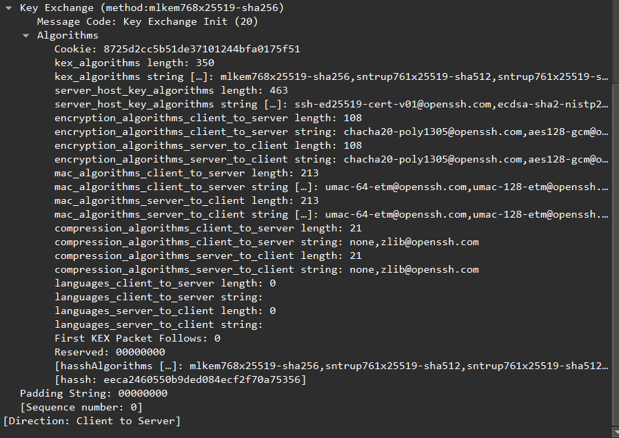

Kredensial tidak terlihat seperti telnet karena SSH melakukan proses kriptografi terlebih dahulu. Setelah proses key exchange, komunikasi SSH dilindungi oleh enkripsi sehingga isi autentikasi dan data sesi tidak dapat dibaca sebagai teks biasa hanya dengan Follow TCP Stream.

## Soal 14


